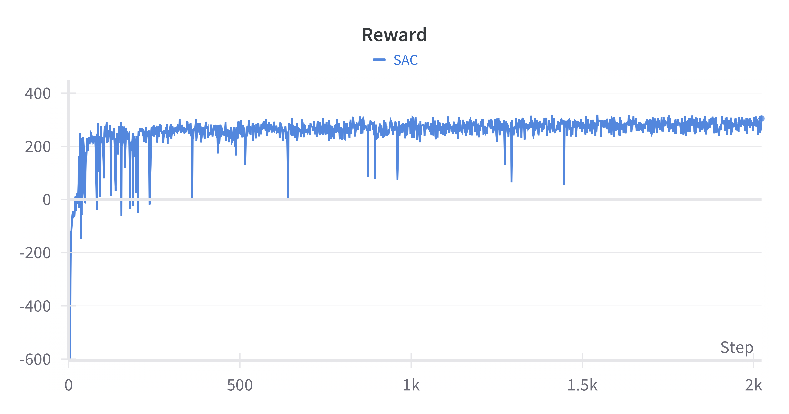
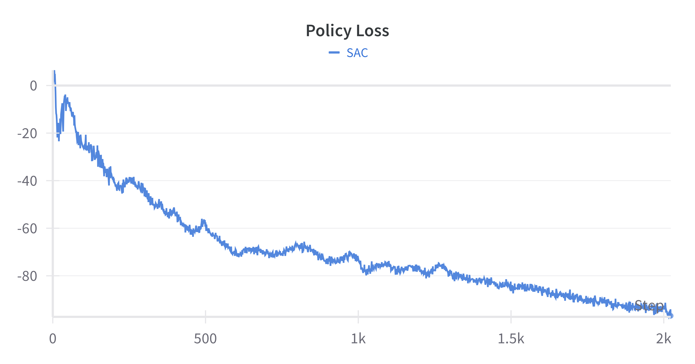
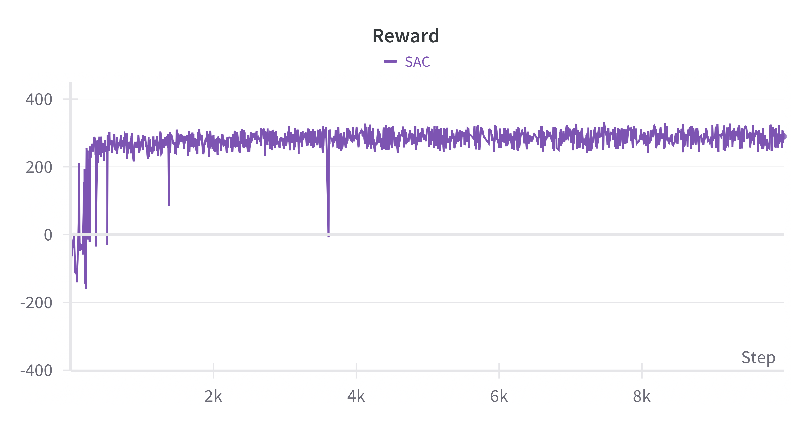
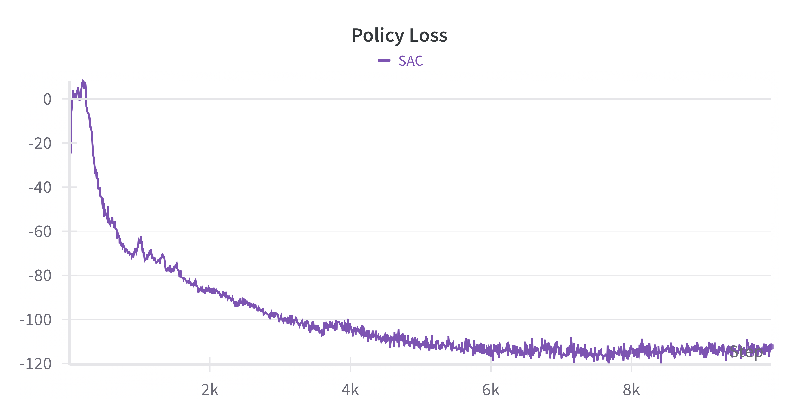
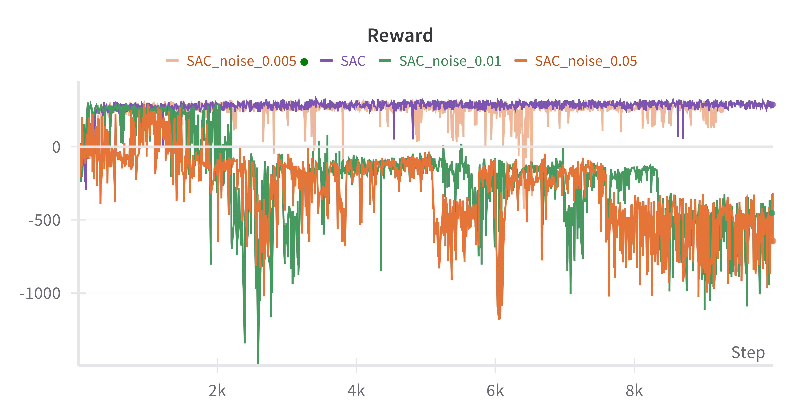
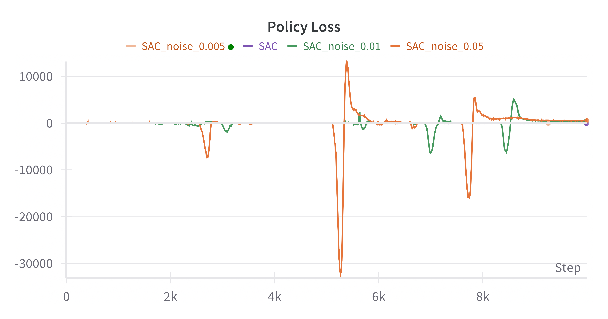
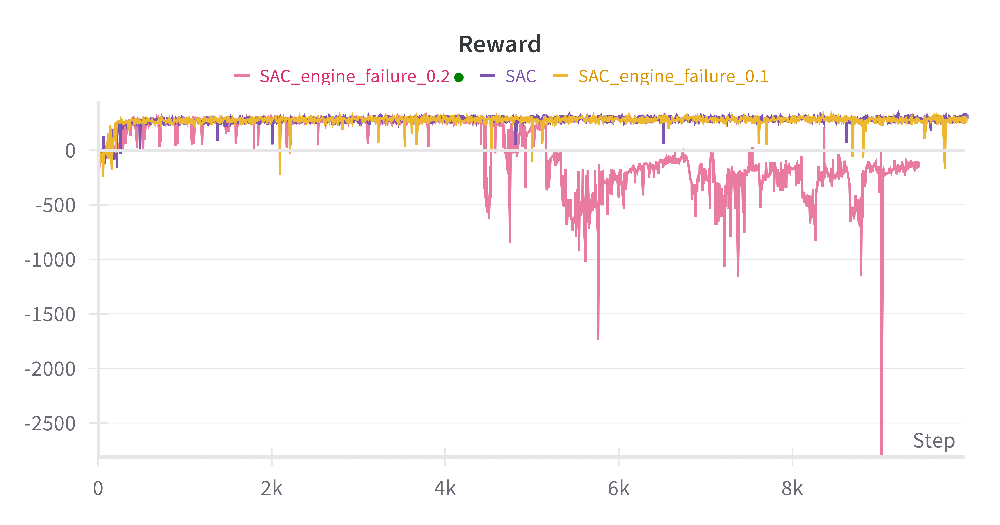
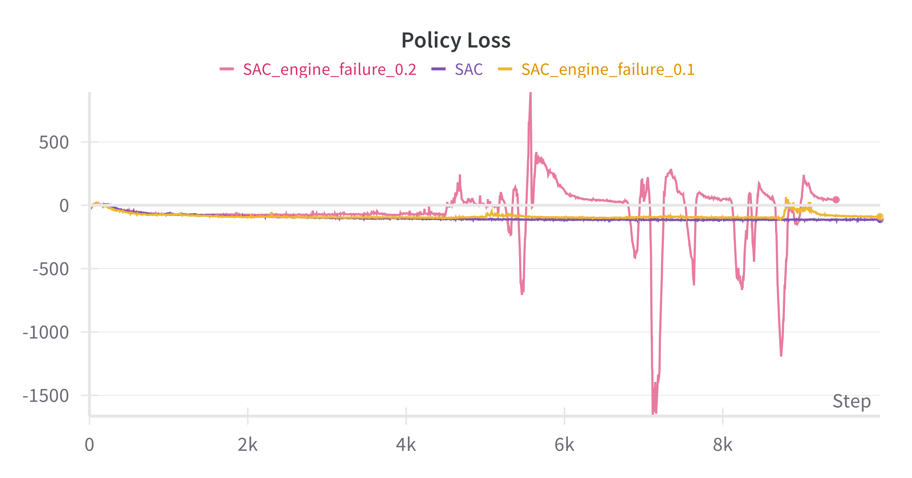

# SAC-Discrete

This directory focuses on the implementation of Discrete Soft Actor-Critic algorithm.

## Directory Structure

```
SAC_Discrete
├── image 
├── README.md
├── SAC.py		# Implementation of SAC and its robustness study
├── requirements.txt
└── trained_models	# Trained model for all the experiments shown below
```

## System specification

The code and the results are tested and trained on `Ubuntu 22.04`, with `CUDA 12.1` and `python 3.7`, using `NVIDIA GeForce RTX 4090`.

## Installation

It is recommended to create a new conda environment to run the project.

```
conda create -n SAC python=3.7
conda activate SAC
```

To install the dependencies :

```
cd SAC_Discrete
sudo apt install -y python3-opengl xvfb swig
pip install -r requirements.txt
```

## Run

Below is the command to run the algorithm. The trainings are logged with wandb.ai.

```
python SAC.py [-e episodes] [-n noise] [-ef engine_failure] [-bs buffer_size] [-s seed] [-se save_every] [-sn save_name] [-bs batch_size]
```

Description:

- `-e` or `--episodes` (int): Total number of episodes to train for (default: 1000)
- `-n` or `--noise` (float): Sigma value for the Gaussian distribution of noisy observations (default: None)
- `-ef` or `--engine_failure` (float): Probability of engine failure (default: None)
- `-bs` or `--bufer_size` (int): Size of the replay buffer (default: 100000)
- `-s` or `--seed` (int): Random Seed (default: 1)
- `-se` or `--save_every` (int): Save the model every n episodes (default: 100)
- `-sn` or `--save_name` (str): The name of the saved model. (defualt "SAC")
- `-bsz` or `--batch_size` (int): Size of the training batch (default: 256)

Specifically, the script used in midterm report is:

```
python SAC.py -n=2000
```

And the script used in final presentation to introduce noisy observation is (take noise 0.01 as an example)

```
python SAC.py -n=10000 -noise=0.01 -sn="SAC_noise_0.01"
```

The script used in final presentation to introduce random engine failure is (take engine failure rate 0.1 as an example):

```
python SAC.py -n=10000 -ef=0.1 -sn="SAC_engine_failure_0.1"
```

## Results

### Original model (used in midterm report)

2000 episodes:

<p float="left">
  
   
</p>

10000 episodes:

<p float="left">
  
   
</p>

### Introducing Uncertainty (used in final presentation)

#### Introduce Noisy Observation

<p float="left">
  
   
</p>

#### Introduce Random Engine Failure

<p float="left">
  
   
</p>
